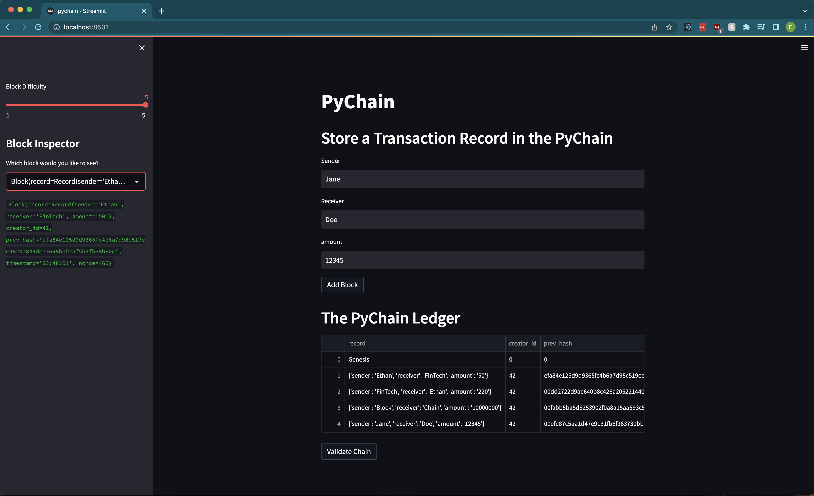
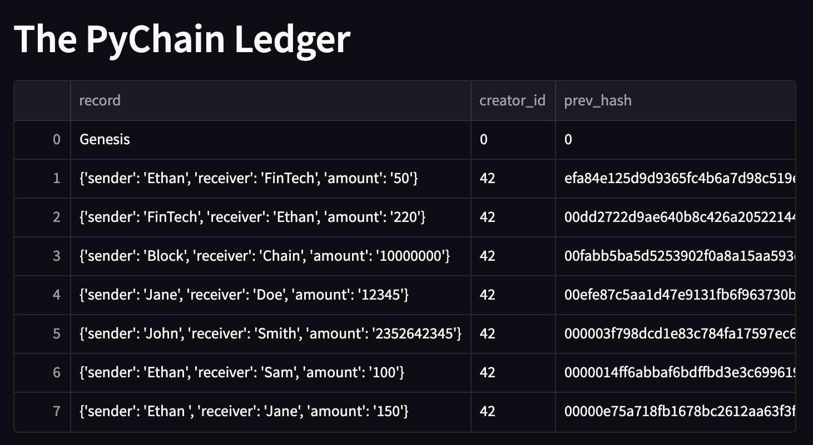
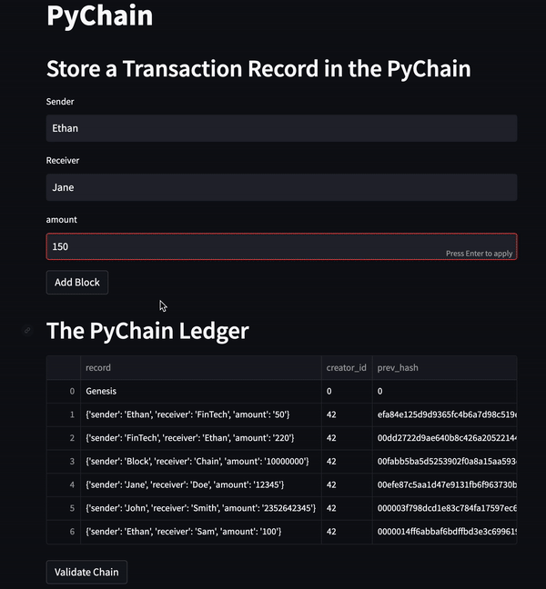

# Blockchain Ledger System - UW FinTech Bootcamp Module 18 Challenge 

This project is my simple blockchain-based ledger system with a web interface. The ledger allows users to conduct financial transactions and verify the integrity of the entire blockchain, or the transaction data in the ledger. 

The blockchain infrastructure is created using Python [dataclasses](https://docs.python.org/3/library/dataclasses.html) and the web UI is created using [Streamlit](https://streamlit.io/)

---

## Summary

With the Streamlit UI, users can run this app to build a record system of financial transactions using blockchain fundamentals. While running the app you can add as many blocks, or transactions, to the chain as you want and determine the block difficulty for each one. 



The ledger appears in the UI as a table with each transaction as a row, and this table serves as a visual representation of the ledger's blockchain infrastructure.



Adding a block will create a new transaction in the ledger and instantly be reflected in the UI table. After each addition to the blockchain you can then verify the integrity of the entire blockchain, meaning that the app will go through each block and validate that it has stored the previous block's hash in its data. 



---

## Technologies

This is a Python 3.7 project ran using the following dependencies:
1. [Pandas](https://github.com/pandas-dev/pandas) (1.3.5) - DataFrame objects
2. [Streamlit](https://streamlit.io/) (1.18.1) - Web interface

---

## Installation Guide

This project was ran using an [Anaconda](https://docs.anaconda.com/) dev environment but assuming you have Python installed you will likely also be able to run this app after installing the required dependencies with Pip: 

```Python
pip install pandas
pip install streamlit
```

The [requirements.txt](./Resources/requirements.txt) file in the Resources folder has the exact anaconda environment that I used in creating this project if you would like to copy it. 

Create a copy of the conda dev environment with `conda create --name myenv --file requirements.txt`

Then install the requirements with `conda install --name myenv --file requirements.txt`

---

## Usage

To run this app locally simply open a terminal window with this project as the main directory and type `streamlit run pychain.py`. This will open the Streamlit web UI in your browser on localhost 8501. 

Caching is used to save any blockchain data that you use while running the app, however this data is lost after the session is over. 

---

## Contributors

[Ethan Silvas](https://github.com/ethansilvas)

---

## License

This project uses the [GNU General Public License](https://choosealicense.com/licenses/gpl-3.0/)